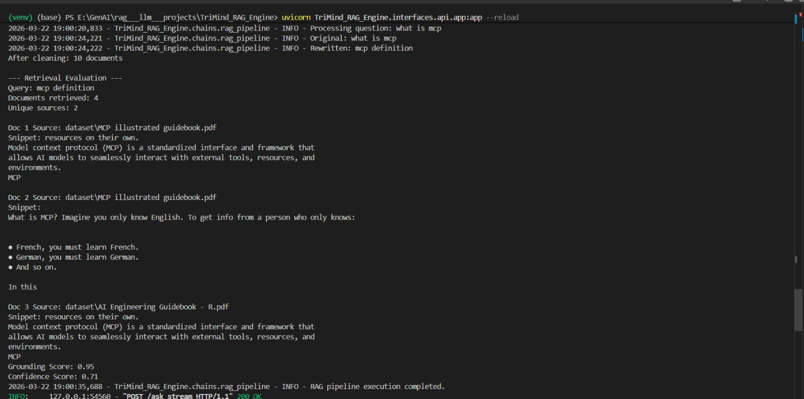
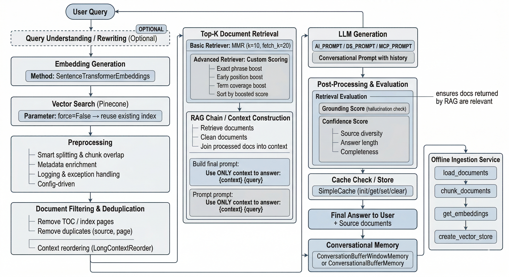
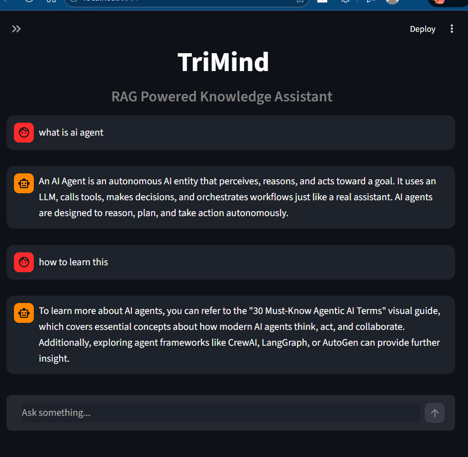

<div align="center">


<br/>

<p align="center">
  <strong>Advanced · Modular · Evaluation-Driven Retrieval-Augmented Generation System</strong><br/>
  <sub>Intelligent Retrieval &nbsp;·&nbsp; Query Optimization &nbsp;·&nbsp; Domain Routing &nbsp;·&nbsp; Conversational Memory &nbsp;·&nbsp; Hallucination Evaluation</sub>
</p>

<br/>


</div>

---

## What is TriMind?

**TriMind RAG Engine** is not a chatbot. It is a **production-grade, evaluation-aware knowledge system** engineered to enhance Large Language Models with external domain knowledge — through intelligent retrieval, query optimization, grounding verification, and conversational memory.

> Most RAG systems retrieve chunks and hope for the best.
> **TriMind measures before it answers.**

Every component has an engineering reason to exist — from query rewriting before retrieval, to grounding score evaluation after generation.

---

## Live System Output

> Real pipeline execution — not mocked, not simulated.



```
Query rewritten  :  "what is mcp"  →  "mcp definition"
Documents cleaned:  10
Documents retrieved: 4  |  Unique sources: 2

Grounding Score  :  0.95    ← hallucination check passed
Confidence Score :  0.71    ← response reliability verified

POST /ask/stream HTTP/1.1  200 OK  ✅
RAG pipeline execution completed.
```

---

## System Architecture

> End-to-end pipeline — from raw user query to evaluated, grounded final answer.



The architecture covers every stage of a production RAG system:

| Stage | What Happens |
|---|---|
| Query Rewriting | Ambiguous queries are rewritten before retrieval to improve recall |
| Embedding Generation | SentenceTransformerEmbeddings convert text to dense vectors |
| Vector Search | Pinecone retrieves semantically similar document chunks |
| Preprocessing | Smart chunking, metadata enrichment, logging, config-driven |
| Filtering & Deduplication | Removes TOC pages, duplicate chunks; applies LongContextReorder |
| Top-K Retrieval | MMR (k=10, fetch_k=20) + custom composite scoring |
| Context Construction | Cleaned docs joined into prompt — `{context}` + `{query}` |
| LLM Generation | AI / DS / MCP domain prompts + conversational history |
| Evaluation | Grounding score (hallucination) + Confidence score (reliability) |
| Cache | SimpleCache prevents redundant LLM calls |
| Memory | ConversationBufferWindowMemory for multi-turn coherence |
| Ingestion (offline) | `load → chunk → embed → store` feeds the Pinecone index |

---

## Live UI

> Multi-turn conversation with domain-aware, grounded responses.



---

## Feature Breakdown

### Retrieval — Beyond Cosine Similarity

Standard RAG ranks chunks by cosine similarity alone. TriMind applies a **composite scoring layer** on top:

| Boost Signal | Purpose |
|---|---|
| Exact phrase boost | Prioritizes chunks containing the exact query phrase |
| Early position boost | Favors chunks appearing early in source documents |
| Term coverage boost | Ranks chunks that cover more query terms higher |
| MMR diversity | Ensures retrieved chunks are non-redundant |

---

### Query Rewriting

```
User input  :  "what is mcp"
Rewritten   :  "mcp definition"
```

Vague queries are rewritten before hitting the vector store — improving recall without changing user intent.

---

### Domain-Aware Routing

Queries are automatically classified and routed to specialized knowledge namespaces in Pinecone:

| Domain | Scope |
|---|---|
| AI Engineering | LLMs, RAG, embeddings, vector databases |
| Data Science | ML concepts, statistics, model evaluation |
| MCP | Model Context Protocol, agentic patterns |
| General | Fallback for broad or mixed queries |

---

### Evaluation Layer

Every response is scored before delivery:

```
Grounding Score  : 0.95   # Is the answer grounded in retrieved context?
Confidence Score : 0.71   # Source diversity + answer length + completeness
```

Low scores surface as warnings. This is the difference between a system that *sounds* right and one that **is** right.

---

### Reliability Engineering

| Mechanism | Implementation |
|---|---|
| Exponential Backoff | Python decorator — retries at 1s → 2s → 4s intervals on rate limits |
| Groq Fallback | Auto-switches LLM if Gemini fails completely |
| Response Caching | SimpleCache eliminates redundant LLM calls |
| Async FastAPI | Non-blocking LLM calls via `async/await` — server never freezes |

---

### Conversational Memory

```
Turn 1: "What is RAG?"
Turn 2: "How does chunking affect it?"     ← references Turn 1 implicitly
Turn 3: "And what about overlap size?"     ← references Turn 2 implicitly
```

Window-based and summarized memory strategies maintain coherent multi-turn context without repetition.

---

## Tech Stack

| Layer | Technology | Role |
|---|---|---|
| Language | Python 3.10+ | Core runtime |
| RAG Framework | LangChain | Pipeline orchestration |
| Vector Database | Pinecone | Semantic storage & retrieval |
| Embeddings | SentenceTransformers (HuggingFace) | Dense vector generation |
| Primary LLM | Google Gemini | Response generation |
| Fallback LLM | Groq (LLaMA-based) | High-availability fallback |
| Backend API | FastAPI (async) | Non-blocking API layer |
| Caching | SimpleCache | Redundancy reduction |

---

## Project Structure

```
TriMind_RAG_Engine/
│
├── TriMind_RAG_Engine/
│   ├── chains/
│   │   └── rag_pipeline.py        # Core RAG chain + evaluation logic
│   ├── interfaces/
│   │   └── api/
│   │       └── app.py             # FastAPI async entry point
│   ├── retriever.py               # Embedding + Pinecone search
│   ├── generator.py               # Gemini + Groq fallback
│   ├── router.py                  # Domain classification
│   ├── memory.py                  # Conversational memory
│   ├── logger.py                  # Structured logging
│   └── utils.py                   # Retry decorators, deduplication
│
├── dataset/                       # Knowledge base documents (PDFs)
├── assets/                        # Screenshots and architecture diagrams
├── requirements.txt
└── README.md
```

---

## Quickstart

```bash
# 1. Clone the repository
git clone https://github.com/bhoomikagoel24/TriMind_RAG_Engine.git
cd TriMind_RAG_Engine

# 2. Create virtual environment
python -m venv venv
source venv/bin/activate        # Windows: venv\Scripts\activate

# 3. Install dependencies
pip install -r requirements.txt

# 4. Configure environment variables
cp .env.example .env
# Add your Pinecone, Gemini, and Groq API keys

# 5. Run ingestion service (first time only)
python -m TriMind_RAG_Engine.ingestion.ingest

# 6. Start the FastAPI server
uvicorn TriMind_RAG_Engine.interfaces.api.app:app --reload
```

---

## Capabilities

- [x] Multi-document RAG over PDFs
- [x] Query rewriting and optimization before retrieval
- [x] Domain-based query routing via Pinecone namespaces
- [x] MMR + custom composite retrieval scoring
- [x] Grounding score — hallucination check on every response
- [x] Confidence scoring — source diversity, length, completeness
- [x] Context-aware multi-turn conversations
- [x] Exponential backoff + automatic Groq fallback
- [x] Response caching layer
- [x] Async FastAPI backend
- [x] Modular, extensible pipeline architecture
- [ ] Hybrid retrieval — dense + sparse BM25 *(planned)*
- [ ] Multimodal RAG — text + image understanding *(in progress)*
- [ ] Self-evaluation and answer verification loop *(planned)*
- [ ] Tool-augmented agentic workflows *(planned)*

---

## Core Philosophy

> **TriMind is not just a RAG chatbot.**
>
> It is a modular, evaluation-aware knowledge system engineered to improve retrieval quality,
> reduce hallucinations, and enable context-aware reasoning over domain-specific data.
>
> Every component has a reason to exist.
> Every response is measured before it is returned.

---

## Author

<div align="center">

**Bhoomika Goel**
*AI & Software Engineering Practitioner*

[](https://github.com/bhoomikagoel24)
[](https://linkedin.com/in/bhoomikagoel24)

*Open to AI/ML Engineering internship opportunities.*

</div>

---

<div align="center">
  <sub>Built with precision &nbsp;·&nbsp; Engineered for reliability &nbsp;·&nbsp; Designed to scale</sub>
</div>